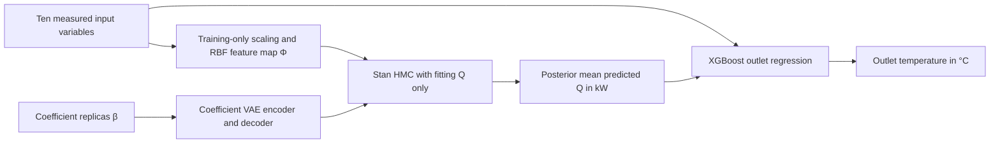

# πVAE → XGBoost for bifacial solar thermal modelling

An auditable **October 2026 reconstruction** associated with Fakir et al., “A Hybrid πVAE-XGBoost Framework for High-Fidelity Simulation of Bifacial Solar Thermal Collectors,” *Materials Research Proceedings* 64 (2026), 171–178. [Publication DOI](https://doi.org/10.21741/9781644904091-21).

**Source repository:** [https://github.com/Mr-Espada/bifacial-solar-pivae-xgboost](https://github.com/Mr-Espada/bifacial-solar-pivae-xgboost). Initial source release: **v0.1.1**, October 2026. Published at Mohammad's explicit direction; this instruction does not independently establish third-party ownership or licensing rights. No blanket project code license is granted; upstream πVAE's MIT notice is preserved separately. Data, trained models, posterior draws and row-level outputs are excluded. See [licensing status](LICENSE.md) and [attribution](docs/ATTRIBUTION.md).

The research models nonlinear relationships among solar irradiance, measured temperatures and environmental conditions in a bifacial collector. The paper describes a πVAE stage predicting thermal power Q and an XGBoost stage using predicted Q and original inputs to estimate outlet temperature. This package makes that interpretation executable and auditable; it does **not** recover the authors' complete final experiment or reproduce their almost-perfect published scores.

## Evidence and contributions

The publication's full author list is **Imane Fakir, Mehdi Nejjar, Mohammad Hachim Eraissouni, Adam Kessab, Ahmed Khallaayoun**, in that order. Based on Mohammad's account, **Mehdi Nejjar** ([Night^^Stalker / @mehdinejjar86](https://github.com/mehdinejjar86)) suggested the overall framework and contributed to the project code. Mohammad contributed primarily to implementation and critical evaluation of the deep-learning component, adapting established πVAE code, participating in modelling revisions, contributing to the corresponding manuscript section, and preparing or contributing to experimental results and figures. Mohammad did not originate the overall framework. The retained files do not independently establish individual code or figure authorship. See [contributors](CONTRIBUTORS.md) and the [contribution evidence sheet](docs/CONTRIBUTION_EVIDENCE.md).

The original neural classes substantially adapt [MLGlobalHealth/pi-vae](https://github.com/MLGlobalHealth/pi-vae), the implementation associated with [Mishra et al. (2022)](https://doi.org/10.1007/s11222-022-10151-w). Preserve [its MIT notice](third_party/pi-vae/LICENSE). The reconstruction, current tests/audit, and repository maintenance are separate AI-assisted work. Co-authorship of the article does not establish software ownership or sole invention of the model.

## Architecture and data flow



Inputs follow paper Fig. 3: `T_in_1C`, `T_amb_outdoorC`, `T_vent_1C`, `T_IR_Tracker`, `G_trackerWm`, `G_diffuseWm`, `IR_TrackerWm`, `v_wind_speedms`, `zenith`, `azimuth`.

PyTorch learns a trainable RBF/tanh feature map Φ(x) and a VAE over coefficient vectors β. The encoder supplies Gaussian mean/log variance; reparameterized latent draws pass through the tanh decoder d(z). Training minimizes direct and decoded reconstruction MSE plus a weighted KL penalty. Thirty-two persistent coefficient replicas represent one observed Q function; they are not independent prior-function draws.

Stan transfers the fixed learned decoder and samples latent z and Gaussian observation sigma, conditioned **only on fitting labels**. An augmented-QR Gaussian likelihood uses every fitting observation without repeatedly evaluating all rows at each HMC step. Frozen Q prediction is E[d(z)]ᵀΦ(x), converted back to kW. Its conditional latent credible and observation predictive intervals are reported separately.

Four whole-day cross-fits produce Q for each training row while excluding its entire day from scaling, neural fitting and posterior conditioning. XGBoost fits outlet temperature on original inputs plus those out-of-fold Q values. A separate all-training πVAE fit supplies test/new-input Q. The tree receives scalar predicted Q, not z, β or actual Q. The allowlist excludes measured Q, outlet and dT, which are algebraically related in these data. There is no test-based checkpoint selection or tree early stopping in the reconstruction.

## Data and expected inputs

Obtain authorized original CSVs separately; no data downloader or redistributed real-data sample is provided. Use `--data-dir` to point to them. [Data policy](docs/DATA.md).

| Input file | Rows | Dates |
|---|---:|---|
| `train_simulation.csv` | 130,048 | 21–27 and 29 August 2024; first/last days partial |
| `test_simulation.csv` | 17,280 | Complete 28 August 2024, five-second cadence |

The 147,328 supplied rows are 68 fewer than the publication states. There are no timestamp duplicates/overlaps or nonfinite numeric values. The reconstruction preserves the supplied row order and split; no observations are fabricated or filtered. SHA-256 hashes, the full 22-column schema and dataset identities are in [the audit](docs/RESEARCH_AUDIT.md).

For new inference, provide chronological unique `Datum` timestamps and the ten numeric feature columns. Q, outlet and dT targets may be absent. The complete held-out experiment uses exactly the above originals. Training includes the day after test: describe it as held-out-day reconstruction, not future forecasting. Several inputs are measured system temperatures, limiting claims of autonomous simulation from external boundary conditions alone.

## Installation

Python 3.10–3.12; new Stan fits require Make and a C++ compiler. From the repository root:

```bash
python3 -m venv .venv
source .venv/bin/activate
python -m pip install torch==2.5.1 --index-url https://download.pytorch.org/whl/cpu
python -m pip install -e .
python scripts/install_cmdstan.py --dir .cmdstan --cores 1
export CMDSTAN="$PWD/.cmdstan/cmdstan-2.37.0"
export OPENBLAS_NUM_THREADS=1
export OMP_NUM_THREADS=2
python -m pytest -q
```

Dependencies are pinned in `requirements.txt`; `xgboost-cpu` exposes the `xgboost` API. On platforms without its wheel, a substitution with `xgboost==3.0.2` needs separate validation. Checks used Linux/Python 3.10.16, the declared numerical pins and CmdStan 2.37.0. A transitive SymPy mismatch in the retained environment was identified; the candidate pins the PyTorch-compatible SymPy 1.13.1 and validates it in an isolated overlay. The old environment remains untouched. A fresh complete toolchain installation and cross-platform execution are unverified. [Stan installation documentation](https://mc-stan.org/docs/cmdstan-guide/installation.html).

Imports do not train, compile or install software. No WandB account is required. The historical script in `legacy/` has import-time side effects and is retained for evidence only.

## Training, inference and evaluation

For a **new reconstruction experiment**, use a fresh run directory and authorized data:

```bash
python -m pivae_hybrid.cli audit --config configs/reconstruction.json --data-dir /path/to/authorized-data
python -m pivae_hybrid.cli run-all --config configs/reconstruction.json --data-dir /path/to/authorized-data --run-dir runs/new-reconstruction
```

The long profile uses 500 fixed epochs per fit, 128 RBF centers, Φ widths 128/128, beta dimension 64, latent dimension 24, VAE widths 128/64, batch 2048, Adam .0003 and KL weight .001. Each of five complete first-stage fits uses four HMC chains with 1,000 warmup/1,000 retained draws, twelve training-only optimizer starts and a dense metric. Tree settings are 500 depth-6 histogram trees, rate .05, row/column sampling .9, lambda 1, seed 20261003. Configs record all settings; these were chosen for reconstruction, not recovered from the paper. Full fitting is substantial CPU work.

`configs/verification.json` is a smaller 80-epoch all-row profile with smaller networks/two chains/300 trees. It is also a real new experiment, not a promise of the long profile's scores. `--baseline-only` runs direct trees and a tree-Q stack without neural/HMC fitting.

Individual commands use the **same** config, data directory and run directory:

```bash
python -m pivae_hybrid.cli train-pivae --config configs/reconstruction.json --data-dir /path/to/authorized-data --run-dir runs/new-reconstruction
python -m pivae_hybrid.cli train-xgb --config configs/reconstruction.json --data-dir /path/to/authorized-data --run-dir runs/new-reconstruction
python -m pivae_hybrid.cli predict --config configs/reconstruction.json --data-dir /path/to/authorized-data --run-dir runs/new-reconstruction
python -m pivae_hybrid.cli evaluate --config configs/reconstruction.json --data-dir /path/to/authorized-data --run-dir runs/new-reconstruction
python -m pivae_hybrid.cli verify-run --config configs/reconstruction.json --data-dir /path/to/authorized-data --run-dir runs/new-reconstruction
```

`evaluate` regenerates all scores and plots without fitting; `verify-run` checks all-row invariance after target deletion/poisoning. New-input prediction:

```bash
python -m pivae_hybrid.cli predict --config configs/reconstruction.json --run-dir runs/new-reconstruction --input-csv new_inputs.csv --output-csv runs/new-reconstruction/new_predictions.csv
```

Completed or interrupted fitting stages with existing artifacts are refused; use a fresh run directory to preserve their logs. Neural/posterior/diagnostic sets, stage outputs and metric inputs are hash-bound, and the hybrid tree is bound to the exact πVAE stage supplying its features. Failed or missing posterior quality reports stop downstream training/inference; configured thresholds are unchanged. Changed source cannot silently continue fitting in an existing run. For older unbound 0.1.0 runs, use the explicit audited-copy procedure in [REPRODUCIBILITY.md](docs/REPRODUCIBILITY.md). Do not edit old manifests manually to claim historical authenticity.

## Results and limits

### Published paper results — reported, not reproduced

The paper's Table 2 gives the following values under “Training Results.” The target/split assignments and complete artifact lineage are unresolved; these figures are transcribed for context and must not be treated as the held-out reconstruction scores below.

| Paper model label | R² | Spearman | Pearson | Evidence |
|---|---:|---:|---:|---|
| πVAE | .9998 | .9986 | .9990 | Published Table 2 only |
| XGBoost | 1 | .9999 | 1 | Published Table 2 only |
| Hybrid | .9999 | .9992 | .9995 | Published Table 2 only |

### October 2026 reconstruction — saved results independently checked

These are the retained **3 October 2026 reconstruction** scores on the single held-out day, recalculated from saved outputs during this audit. They are distinct from paper-reported Table 2.

| Model | Target | R² | MAE | RMSE |
|---|---|---:|---:|---:|
| πVAE | Q, kW | .994684 | .042240 | .072010 |
| Direct XGBoost | Q, kW | .997169 | .031508 | .052557 |
| Direct XGBoost | Outlet, °C | .997849 | .106478 | .171045 |
| πVAE-Q → XGBoost | Outlet, °C | .997968 | .103431 | .166222 |
| XGBoost-Q → XGBoost | Outlet, °C | .997262 | .114499 | .192972 |

All 12 model/split aggregate records, including Pearson/Spearman and training versus out-of-fold scores, are retained in [results](results/reconstruction-2026-10-03/RESULTS.md) and `metrics.csv`. All metrics use every row; Q/outlet tasks have different units and should be compared separately. Training second-stage scores use out-of-fold Q inputs but are in-sample outlet fits.

### Later diagnostic comparison and limitations

The hybrid's outlet RMSE gain over direct trees is .004823 °C (2.82%) on one day. πVAE underperforms direct trees for Q. A review-driven energy-balance diagnostic, `T_out = T_in + 3.079510965 × predicted_Q_XGB` with its slope fitted on training rows, reaches .161861 °C test RMSE. It is slightly better than the hybrid and is a post-publication diagnostic, not a pre-specified historical benchmark. These observations do not establish that πVAE or a second tree stage is necessary, or that the hybrid is generally superior.

Observation predictive interval coverage averages 94.473% but falls to 42.64% at noon. Computational HMC convergence does not establish predictive calibration or model optimality. Fixed neural weights, a single iid noise scale, mode-local HMC starts, dependent five-second errors and absent downstream uncertainty propagation limit interpretation. The single observed-function replicas differ from foundational πVAE prior-function training. Future work needs nested whole-day outlet validation, repeated seeds, physical/deterministic ablations, fresh independent data and regime-aware calibration.

The original source targets mass flow, conditions Stan on test labels, omits inlet temperature and contains no XGBoost stage. Original final models/predictions/settings, simulator code and exact figure lineage are missing. The paper also has count, power/energy, year and table/split ambiguities. **Its Table 2 remains paper-reported, not independently reproduced.** See the explicit claim/table/figure mapping in [RESEARCH_AUDIT.md](docs/RESEARCH_AUDIT.md).

## Repository layout

```text
src/pivae_hybrid/       Models, training, posterior, trees, inference, metrics, integrity
configs/               Explicit 2026 long and short experiment profiles
scripts/               CmdStan installer, audited saved-run import, release checker
tests/                 Leakage, numerics, artifact and logging regression checks
notebooks/historical/  Source-only historical notebook; not a reproduction entrypoint
legacy/                Original historical Python/Stan for comparison
results/               Aggregate 2026 scores; no individual observations
figures/               Figure provenance policy; generated plots stay private
docs/                  Audit, contribution sheet, reproducibility, rights and validation
third_party/pi-vae/    Preserved upstream MIT notice
README.md              Research/workflow/evidence guide
CHANGELOG.md           Original versus 2026 versus future work
CITATION.cff           Preferred research citation; no ownership grant
CONTRIBUTORS.md        Named historical roles and their evidence boundaries
LICENSE.md             Unresolved project licensing and upstream/data distinctions
CONTRIBUTING.md        Provenance-preserving change and validation workflow
requirements.txt       Pinned numerical/model dependencies
pyproject.toml         Installable package and command
```

Runs write private `resolved_config.json`, environment/code/stage manifests, neural/tree models, posterior/chain files, train/test predictions, metrics, quality reports and PNG/SVG plots. `.gitignore` excludes them. The original-folder archive and sensitive evidence remain outside the candidate. No original file was deleted or moved. [Validation record](docs/VALIDATION.md).

```bash
python scripts/check_release.py
python scripts/check_release.py --require-public-approval
```

The second command checks the recorded explicit user publication instruction and refuses an unapproved blanket license assertion. It does not certify ownership or data-provider permission. The [publication record](docs/RELEASE_CHECKLIST.md) keeps those unresolved questions separate from technical validation.

## Citation

Imane Fakir, Mehdi Nejjar, Mohammad Hachim Eraissouni, Adam Kessab, Ahmed Khallaayoun (2026). A Hybrid πVAE-XGBoost Framework for High-Fidelity Simulation of Bifacial Solar Thermal Collectors. *Materials Research Proceedings*, **64**, 171–178. [https://doi.org/10.21741/9781644904091-21](https://doi.org/10.21741/9781644904091-21).

Use `CITATION.cff`'s preferred citation for the paper. Research authorship, software contributions, upstream attribution and dataset rights are documented separately; do not assign the collective repository work solely to Mohammad.
