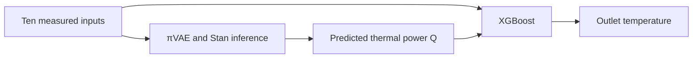

# Bifacial solar thermal modelling with πVAE and XGBoost

This project models a bifacial solar thermal collector from measured temperatures, irradiance and weather conditions. A πVAE estimates thermal power, Q; XGBoost then uses predicted Q and the original inputs to estimate outlet temperature.

The repository accompanies [Fakir et al. (2026)](https://doi.org/10.21741/9781644904091-21). It contains historical source and an October 2026 reconstruction of the hybrid pipeline. The reconstruction's results are listed separately below; the paper's numerical experiment could not be reproduced from the available files.

## Pipeline



The first stage learns an RBF/tanh feature map and a variational autoencoder over its coefficients. Stan samples the latent variables and observation noise with the trained decoder fixed. Input and target scaling use training data only.

Four whole-day cross-fits supply out-of-fold Q predictions for training XGBoost. A separate πVAE fit on all training rows supplies Q at test time. The tree receives scalar predicted Q and the ten original features. Measured Q, outlet temperature and temperature difference are excluded from its inputs. Test labels are excluded from fitting and model selection.

The ten features cover inlet, ambient, vent and tracker temperatures; global, diffuse and infrared irradiance; wind speed; zenith; and azimuth. Column names and file requirements are in [DATA.md](docs/DATA.md).

## Setup

Use Python 3.10–3.12. New Stan fits also need Make and a C++ compiler.

```bash
python3 -m venv .venv
source .venv/bin/activate
python -m pip install torch==2.5.1 --index-url https://download.pytorch.org/whl/cpu
python -m pip install -e .
python scripts/install_cmdstan.py --dir .cmdstan --cores 1
export CMDSTAN="$PWD/.cmdstan/cmdstan-2.37.0"
export OPENBLAS_NUM_THREADS=1
export OMP_NUM_THREADS=2
python -m pytest -q
```

Dependencies are pinned in `requirements.txt`. Validation used Linux, Python 3.10.16 and CmdStan 2.37.0; other platforms have not been checked. See the [validation record](docs/VALIDATION.md).

## Run the reconstruction

Data is not included. Obtain authorized copies of `train_simulation.csv` and `test_simulation.csv`, then pass their directory:

```bash
python -m pivae_hybrid.cli audit --config configs/reconstruction.json --data-dir /path/to/authorized-data
python -m pivae_hybrid.cli run-all --config configs/reconstruction.json --data-dir /path/to/authorized-data --run-dir runs/new-reconstruction
```

The full profile runs five πVAE fits, each with 500 neural epochs and four HMC chains, followed by the tree models. It requires substantial CPU time. `configs/verification.json` provides a smaller, 80-epoch profile. Use a fresh run directory for each experiment, including after an interrupted fit.

To regenerate scores and figures from a completed compatible run:

```bash
python -m pivae_hybrid.cli evaluate --config configs/reconstruction.json --data-dir /path/to/authorized-data --run-dir runs/new-reconstruction
```

For new inputs, provide `Datum` and the ten feature columns; target columns are optional:

```bash
python -m pivae_hybrid.cli predict --config configs/reconstruction.json --run-dir runs/new-reconstruction --input-csv new_inputs.csv --output-csv runs/new-reconstruction/new_predictions.csv
```

Runs save configurations, models, posterior samples, diagnostics, predictions, metrics and plots locally. These files are ignored by Git. Artifact hashes prevent mixed model/posterior pairs, and failed posterior diagnostics stop downstream use. Stage commands, saved-run import and further checks are documented in [REPRODUCIBILITY.md](docs/REPRODUCIBILITY.md).

## Results

The paper's Table 2 reports the following values under “Training Results.” Its target and split assignments are unclear, and the original models and predictions are missing.

| Paper model | R² | Spearman | Pearson |
|---|---:|---:|---:|
| πVAE | .9998 | .9986 | .9990 |
| XGBoost | 1 | .9999 | 1 |
| Hybrid | .9999 | .9992 | .9995 |

The October 2026 reconstruction used 130,048 training rows and all 17,280 rows of the held-out day, 28 August 2024. These scores were recalculated from saved outputs without retraining:

| Model | Target | R² | MAE | RMSE |
|---|---|---:|---:|---:|
| πVAE | Q, kW | .994684 | .042240 | .072010 |
| Direct XGBoost | Q, kW | .997169 | .031508 | .052557 |
| Direct XGBoost | Outlet, °C | .997849 | .106478 | .171045 |
| πVAE-Q → XGBoost | Outlet, °C | .997968 | .103431 | .166222 |
| XGBoost-Q → XGBoost | Outlet, °C | .997262 | .114499 | .192972 |

The hybrid reduced outlet RMSE by 2.82% against direct XGBoost on this one day. A later energy-balance diagnostic using tree-predicted Q reached .161861 °C RMSE, slightly better than the hybrid. That comparison was made after publication. Full aggregate scores are in [results](results/reconstruction-2026-10-03/RESULTS.md).

## Limitations

The test covers one day, with strongly correlated five-second observations. Training includes the following day, so this is held-out-day reconstruction rather than future forecasting. Some inputs are measured system temperatures. The small hybrid gain does not establish general superiority.

The πVAE uses coefficient replicas of one observed Q function, rather than a collection of independent prior functions. Neural weights stay fixed during HMC, and Q uncertainty is not propagated through the tree. Observation interval coverage averages 94.473% but drops to 42.64% around noon. Good HMC convergence therefore does not imply well-calibrated predictions.

The historical script targets mass flow, conditions Stan on test labels, omits inlet temperature and contains no XGBoost stage. Its final models and the simulator needed for the paper's CARNOT comparison are missing. The [research audit](docs/RESEARCH_AUDIT.md) maps the paper's claims and figures to the available source.

## Files

- `src/pivae_hybrid/`: models, training, inference and evaluation.
- `configs/`: full and smaller reconstruction profiles.
- `scripts/` and `tests/`: installation, saved-run import and checks.
- `legacy/` and `notebooks/historical/`: historical code for reference.
- `results/`: aggregate scores; `docs/`: data, methods and validation notes.

## Credits and license

Mehdi Nejjar ([@mehdinejjar86](https://github.com/mehdinejjar86)) suggested the framework and contributed to the code. Mohammad Hachim Eraissouni worked on the deep-learning implementation and evaluation. See [contributors](CONTRIBUTORS.md).

The πVAE implementation adapts [MLGlobalHealth/pi-vae](https://github.com/MLGlobalHealth/pi-vae). Its MIT notice is retained in [third_party/pi-vae/LICENSE](third_party/pi-vae/LICENSE). The solar-project code has no project-wide open-source license; see [LICENSE.md](LICENSE.md).

## Citation

Imane Fakir, Mehdi Nejjar, Mohammad Hachim Eraissouni, Adam Kessab, Ahmed Khallaayoun (2026). “A Hybrid πVAE-XGBoost Framework for High-Fidelity Simulation of Bifacial Solar Thermal Collectors.” *Materials Research Proceedings*, **64**, 171–178. [DOI: 10.21741/9781644904091-21](https://doi.org/10.21741/9781644904091-21).

Please cite the paper when using this work. Citation metadata is available in [CITATION.cff](CITATION.cff).
